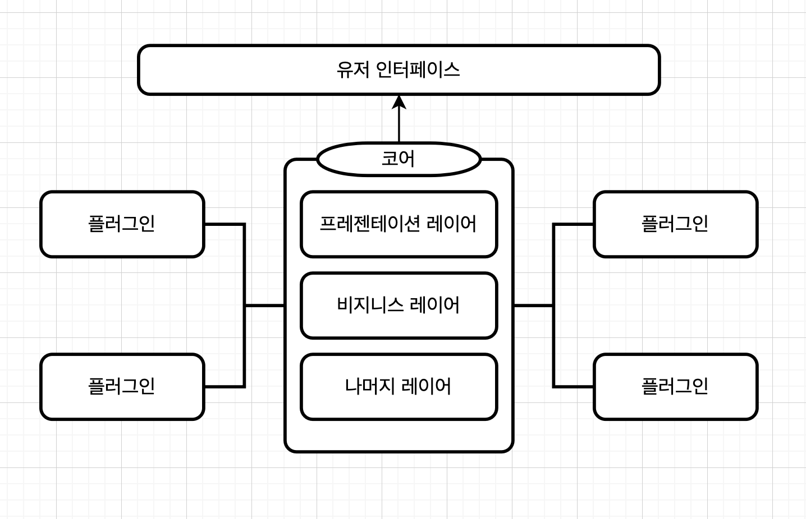
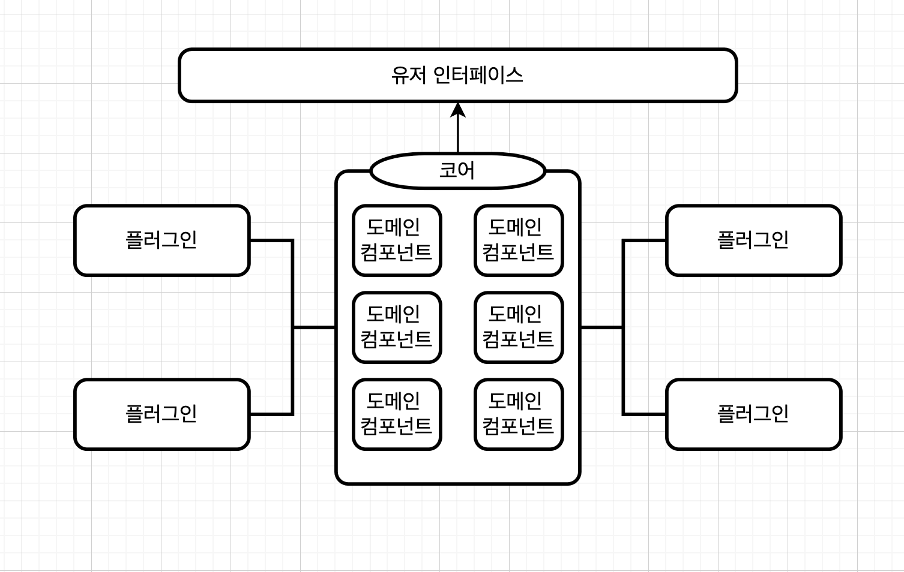

# 마이크로 커널 아키텍처

단일 모놀리식배포 단위로 패키징해서 다운로드 및 설치가 가능하며, 보통 고객사이트에서 서드파티나 제품으로 설치되는 제품기반 애플리케이션에 적합합니다.


## 토폴로지

마이크로 커널 아키텍처의 스타일은 **코어 시스템**과 **플러그인 컴포넌트** 두가지로 나뉘는 비교적 단순한 **모놀리식 아키텍처**입니다.

플러그인 컴포넌트는 독립적으로 코어시스템에 골고루 분산되어 **확장성, 적응성, 애플리케이션 기능 분리, 커스텀 처리**등을 수행합니다.


## 코어 와 플러그인

**코어**

>  코어 시스템은 시스템을 실행시키는 데 필요한 최소한의 기능입니다.

예를들어 **웹스톰 IDE**로 예를 들수있습니다.

이클립스에서 코어 시스템은 다음과 같을수 있습니다.

- 파일 열기
- 텍스트 수정
- 파일저장

시스템을 실행하기위한 단순한 편집툴로써 핵심 코어 기능을 최소화하였습니다.

나머지는 이를 조금더 보완하는 플러그 인으로 대체됩니다.

코어는 복잡도에 따라 레이어드 아키텍처나 모듈러 모놀리스로 구현할 수 있습니다.


**플러그인**

> 플러그인 컴포넌트는 특수한 로직, 부가 기능, 코어시스템을 개선/확장하기 위한 커스텀 코드가 추가된 에드온 스탠드얼론 컴포넌트입니다.

이때 이상적인 플러그인은 상호 독립적이며 의존성이 없습니다.

즉, 다른 플러그인이 없으면 동작할 수 없는 형태가 아니라 단독 플러그인으로써 동작을 보장해야합니다.

이런 형태를 유지하기위해 공유라이브러리 ( `jar`, `dll`, `gem` 등 ), 패키지 등을 사용할수 있습니다.

다시 **웹스톰 IDE**로 예를 들면 플러그인 컴포넌트는 다음과 같을수 있습니다.

- 폴더 구조 시각화 기능
- 터미널 기능
- 깃허브 기능

각 기능은 본래의 핵심에는 영향을 끼치지 않으며 각자의 독립적인 기능으로써 그 역할을 수행합니다.

플러그인과 코어는 점대점 (진입점 함수 - 진입점 함수) 통신을 하며, 규모에 따라 MSA패턴을 통해 REST통신이 될수도 있습니다.


**레이어드 아키텍처 코어**

 


**모듈러 코어**

 


## 레지스트리와 계약

**레지스트리**

> 플러그인 모듈에 대한 정보를 등록하고 관리합니다.

레지스트리에는 플러그인의 명칭, 데이터 계약, 세부 원격 액세스 프로토콜 등 각 플러그인 모듈에 관한 정보가 있습니다.

이 정보는 코어에서 임포트 또는 로드하여 사용될 것입니다.

```
```


**계약**

> 코어시스템에서 플러그인을 사용하기 위한 행위입니다.

코어 시스템에서 플러그인을 사용하기 위해서는 레지스트리로부터 플러그인에 대한 정보를 가져온 다음 시스템에 등록을 한후 사용합니다. 

그리고 사용이 다 끝나면 등록된 플러그인을 해제 해줍니다.

일반적으로 계약은 XML이나 JSON 또는 객체 형태로 구현을 합니다.

이 방법은 코어와 플러그인이 의존성없이 독립적으로 존재할수 있도록 해줍니다.


## 사례

1. **마이크로 커널 아키텍처**

   - 이클립스 IDE

   - 지라

   - 젠킨스

2. **마이크로 커널 응용 아키텍처**

   - 크롬

   - 파이어폭스

3. **어플리케이션 적용 예시**

   마이크로 커널 아키텍처는 이외에도 비지니스 어플리케이션에 적용할수 있는데 보험금 청구회사의 경우가 그렇습니다.

   보험금의 경우 관할구역에따라 규정이 제각각이기 때문에 이를 잘못 합쳐 개발을 하게되면 

   코드수정마다 관할 구역의 인원이 와서 규정을 확인을 해야하는 큰 진흙탕이 될 수 있습니다.

   위 사항을 별도의 스탠드얼론 플러그인으로 보관을 하여 관할 구역에 맞는 규칙으로 개발을 한다면 

   다른 시스템 파트에 영향을 주지 않고 개발을 할 수 있습니다.


## 장단점

**장점**

- 도메인 분할과 기술 분할이 모두 가능한 유일한 아키텍처입니다.
- 위치나 클라이언트 등에 설정이 달라지는 문제에 대해서 훌륭한 퍼포먼스가 발휘됩니다.
- 커스터 마이징, 기능 신장성에 중점을 둔 제품 또는 어플리케이션에 강합니다.
- 기능을 독립적인 플러그인 컴포넌트로 분리할 수 있어 테스트, 배포, 신뢰성에 대한 리스크가 줄어듭니다.
- 스탠드얼론 플러그인을 통해 기능을 추가, 삭제, 변경할 수 있고 개선/확장에 용이합니다.


**단점**

- 자칫하면 서드파티가 메인이 돼버리는 개발이 될수있습니다.
- 생소한 아키텍처이다보니 레퍼런스를 찾기가 어려울수 있습니다.
- 목적에 맞게 사용하지 않으면 큰 진흙탕으로 번질수 있습니다.