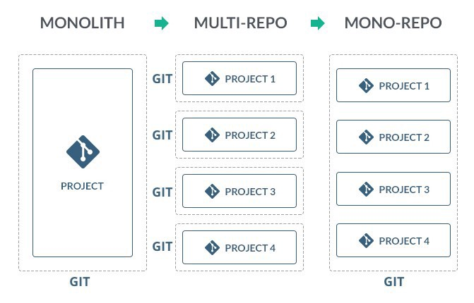
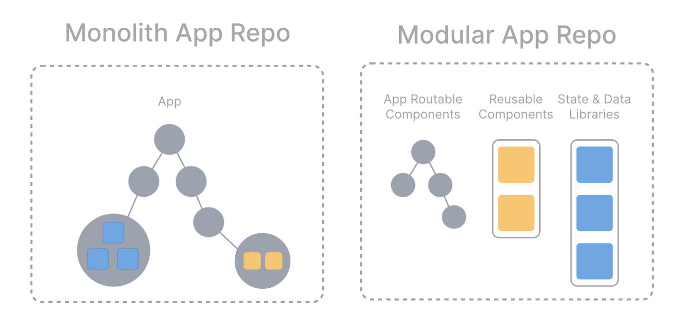
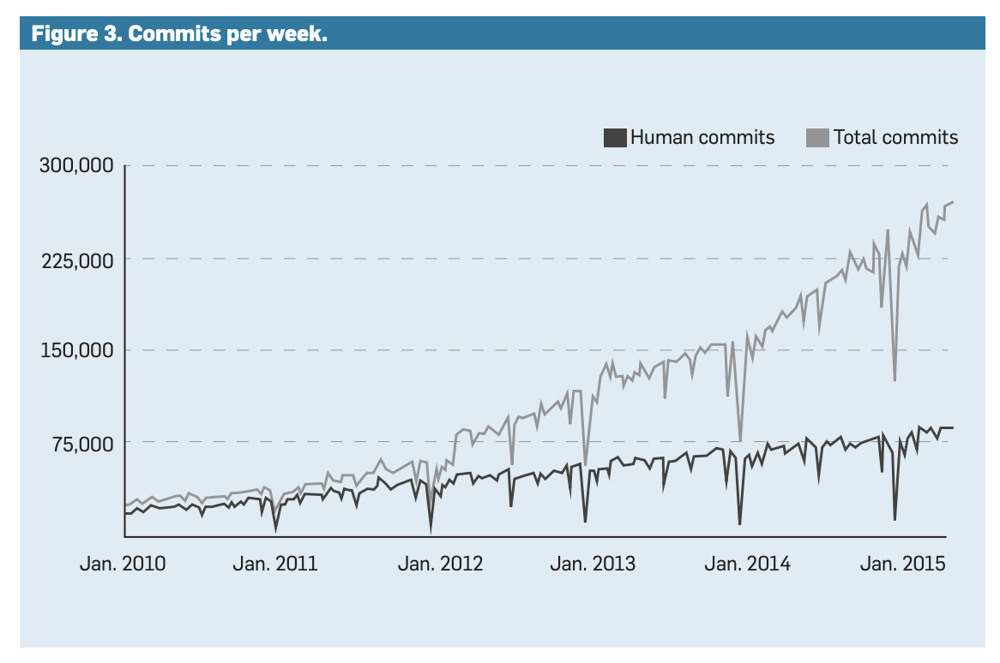

# 모노 레포지토리

## **MonoRepo란?**

한 마디로 정리하자면 **독립된 여러 프로젝트를 하나의 저장소, 하나의 코드 베이스로 관리하는 것**을 말한다.

하나의 저장소로 관리한다는 것은 당연한 느낌이고, 여기서 중요한 점은 ‘독립된 여러 프로젝트’라는 점이다.

설명

예를 들어 한 레포지토리에서 유저가 직접 볼 수 있는 상품 페이지와, 상품에 대한 정보를 관리할 수 있는 어드민 페이지를 같이 묶고 있다고 생각해보자.

두 페이지를 구분 없이 섞어서 구성하고 마구잡이로 참조해 독립이라는 느낌이 안드는 경우 Monolithic Repository라고 볼 수 있다. 얘도 따지면 하나의 레포지토리는 맞지만 우리가 원하는 MonoRepo는 이런 형태가 아니다.

위 이미지를 보면 알겠지만 여러 프로젝트를 각각의 Git 레포지토리로 관리해, 서로 참조해야 할 일이 있으면 합쳐서 패키징하는 방식의 **MultiRepo** 방식을 많이 채택했다. 이렇게 만드는 경우도 굉장히 많고, 주로 **PolyRepo**라고 말한다.

그러다 **여러 패키지 사이의 참조 관계라거나, 관리의 용이성을 살리기 위해 독립된 각 프로젝트를 하나의 레포지토리에 묶는 MonoRepo 개념도 널리 사용되기 시작**했다.

이 경우는 상품 페이지와 어드민 페이지가 같은 레포지토리에는 있지만, 확실히 구분짓는다. 만약 상품 페이지 쪽에서 만든 로직이 어드민 페이지에서도 필요하다면, 이를 서로 패키지처럼 참조하도록 하고 각자의 코드 내부에는 참견하지 않도록 구성할 수 있다.

그래서 요즘 MonoRepo의 핵심은 **모듈화**라고 생각한다.

코드를 잘 모듈화함으로써 얻을 수 있는 장점은 이렇다.

- 각 기능을 모듈로 잘 분리함으로써 캡슐화를 이룰 수 있다
- 기능이 잘 분리되어있으므로 대규모 프로젝트에서 수많은 코드를 들춰봐야 할 수고를 줄일 수 있다
- 소프트웨어 확장이 쉬워진다
- 테스트가 쉬워지고, 모듈의 대체성을 높일 수 있으므로 A/B 테스트도 쉬워진다

모듈화 자체는 PolyRepo로도 잘 구축할 수 있지만, MonoRepo의 각 패키지를 넘나드는 작업이나 서로 참조하기가 쉽다는 특징과 모듈화가 잘 합쳐지면 그 시너지가 크다.

**구글도 쓰는 MonoRepo**

구글에서도 MonoRepo를 사용하고 있다. 그것도 몇몇 프로젝트(Chromium, Android 등)를 제외하면 대부분의 코드가 하나의 레포지토리에서 관리되고 있다.

구글에서 이 MonoRepo를 어떻게 사용하고 있는지, 왜 사용하고 있는지 [설명하는 문서](https://dl.acm.org/doi/pdf/10.1145/2854146)가 있다. 여기서 구글이 제시한 MonoRepo의 장점과 단점을 확인해보려고 한다. 그 전에 구글의 MonoRepo를 살짝 알아보자.

구글은 2016년 기준으로 86TB의 데이터를 가지고 있고, 900만개의 소스 코드 파일이 있다고 한다.

이 코드 베이스를 전 세계에 있는 당시 구글 개발자 25,000여명이 공유하며 개발했다고 한다.

위 이미지에서 확인할 수 있듯 이 수많은 개발자들이 2015년 무렵에는 1주일에 25만 개의 커밋이 새롭게 찍히고, 1,500만 줄의 변경점이 생긴다.

이렇게 보면 정말 말이 안된다. 나같이 작은 회사에서 일하는 개발자 입장에서는 상상조차 안되는 크기다. 86TB를 어떻게 다운받아서 어떻게 사용할지 어지럽다.

구글은 이를 관리하기 위해 Piper, CitC 라는 이름의 내부 코드 버전 관리 시스템, 클라우드 시스템을 이용하고 있다. 이것만 만드는 팀이 따로 있다. 이는 Git 같은 분산 버전 관리 시스템이 아니라, 중앙 버전 관리 시스템으로, 중앙의 Piper 시스템과 꾸준히 동기화해가며 코딩하도록 되어있다.

이 코드 베이스를 하나로 사용하기 위한 Piper, CitC를 만들다보니 클라우드 기술이 더 발전했다고 말하고도 있다. 실제로 전 세계에 몇 개의 서버를 두고 이를 계속 동기화시키면서 개발하고 있는 것으로 보인다.

1999년에 정한 방식을 왜 아직도 고수하고 있을까 싶기도 한데, 구글도 Git으로 넘어가는걸 고민을 해봤다고 적혀있다. 하지만 지금 쌓아둔 인프라만으로도 잘 돌아가고 있고, 보안적인 문제 때문에 굳이 옮기지는 않는다고 한다.

## **MonoRepo의 장점과 단점**

그러면 구글이 말하는 MonoRepo의 장점에는 어떤 것이 있을까?

- **Unified Versioning**

하나의 레포지토리는 버전 관리를 한 번에 할 수 있다. 여러 레포지토리로 굴러갈 때는 각자 버전을 관리하다보니 누락되거나 다른 레포지토리와 연결할 때 버전을 계속 확인 및 맞춰줘야 하는 귀찮음이 있다. 하지만 한 레포지토리로 관리하면 아예 버전을 하나로 관리하거나, 여러 모듈의 버전을 관리하기 수월해진다.

- **Extensive Code Sharing & Reuse**

가끔은 다른 팀이 만든 코드에 있는걸 사용해야 할 때가 있다. 예를 들면 재사용되는 디자인 컴포넌트들이나, 구글이 가지고 있는 풍부한 내부 라이브러리가 있을 것이다. 이를 적절히 공유하고 재사용할 수 있으므로 업무 효율을 높일 수 있다.

- **Simplified Dependency Management**

외부 라이브러리를 사용하는 경우도 분명히 있을텐데, 그런 외부 디펜던시의 버전을 맞추기 용이해진다. MonoRepo를 잘 사용하면 베이스 라이브러리만 변경되더라도 Final Product 단까지 잘 적용할 수 있다.

- **Atomic Changes**

변경 사항을 보다 Atomic하게 관리할 수 있다. 원자적이라는 말은 더 쪼개지지 않는, 그 중간 과정을 확인할 수 없다는 의미로 받아들이면 된다.

만약 어떤 라이브러리 코드를 바꿔서, 이를 이용하고 있는 다른 PolyRepo 레포지토리들을 돌아다니면서 하나 바꾸고 커밋 찍고, 또 하나 바꾸고 커밋 찍고… 이런 과정이 연속적으로 이뤄지게 된다. 이런게 변화하는 중간 과정이 보인다고 생각할 수 있다. 만약 각 커밋마다 테스트가 돌아간다면 각 레포에서 커밋을 찍을 때마다 테스트가 터져서 마음이 아프기도 할 것이다.

하지만 MonoRepo로 하면 어떤 변경 사항을 여러 독립된 프로젝트에서 적용해야 하면 한번에 고쳐서 하나의 커밋으로 관리할 수 있다. 이걸 변화 과정이 원자적이라고 말할 수 있을 것이다.

- **Large Scale Refactoring**

여러 독립적인 프로젝트에 적용되어야 하는 변화사항의 경우 각각 돌아다니면서 고치는 것보다는 한 레포지토리에서 고치는게 훨씬 쉽다.

- **Flexible Team Boundaries and Code Ownership**

팀 간 협업이 자유로워진다. 서로 같은 코드 베이스에서 일하고 있기 때문에 변경 사항이 있거나 협업할 일이 있으면 보다 유연하게 코드를 왔다갔다 할 수 있다. 동시에 코드에 대한 Ownership도 자유로워질 것이다.

그러면 어떤 단점이 있을까? 일단 구글에서 제시한 단점이 몇가지 있긴 하다.

- **Tooling Investments for Both Development and Execution**

개발 및 실행에 필요한 환경을 구성하는데 투자를 해야 한다.

근데 사실 이건 설정을 여기저기서 할 필요 없이 MonoRepo에서 한 방에 할 수 있다는건 오히려 큰 장점이라고 생각된다. 하지만 단점인 이유는 바로 86TB의 구글 코드 베이스라서 그렇다.

코드가 너무 많아서 인덱싱 기능도 구글에서 직접 만들어야 하고, IDE도 구글 코드에 맞게 이클립스를 개조해야 했다. 그리고 코드가 계속 늘어나고 있으므로 이에 대해 꾸준히 추가적인 개발 코스트가 들어가는 상황이다.

근데 일반적인 회사에서는 단점이라고 볼 수는 없을 것 같다.

- **Effort Invested in Code Health**

MonoRepo에서는 디펜던시를 추가하는 것이 쉽다보니, 그냥 별 생각 없이 라이브러리를 다운받고 그냥 놔두거나, 옛날에 썼지만 어쩌다보니 안쓰게 된 디펜던시들이 많이 생기다고 한다. 또한, 구글에서는 내부에서 사용할 라이브러리 개발에 집중하는 개발자도 있는데, 그 개발자 입장에서는 사용하는 곳을 확인하고 싶을 때 불편한 점이 있다고 한다.

사실 PolyRepo를 한다고 해서 해결되는 문제인가 싶기는 한데, 실제로 나도 outdated된 라이브러리가 많이 남아있던 경험을 해서 공감이 되긴 한다.

이것만으로는 부족한 것 같아서, 단점을 조금 더 찾아보았다.

- **Code Ownership에 위배된다**

서비스, 시스템, 모듈, 컴포넌트 등의 소유권은 단일 개발팀에 속해야 한다고 생각하는 개발자도 많다. 각 코드에 대한 소유권, 변경 사항에 대한 책임이 모두 소유자에게 있도록 하는 것이 코드 관리에 더 도움이 된다는 입장이다.

구글에선 장점이라고 했던 유연한 소유권이 코드 관리를 더 어렵게 할 수도 있다는 의견이다.

- **대규모 리팩토링이 쉬워지는 나쁜 관행이 생긴다**

또 구글은 대규모 리팩토링이 쉬워지는게 장점이라고 했지만, 이게 치명적인 단점이라고 생각하는 사람도 있다.

거대한 프로젝트에서 팀 경계를 넘나드는 대규모 리팩토링을 하는 것은 굉장히 위험한 점이 있기 때문에, 여러 단계를 거치면서 각 레포지토리에 대한 Ownership을 가진 팀의 승인을 받아 진행하는 것이 좋다고 볼 수도 있다.

## **MonoRepo, 어떨 때 쓰는게 좋을까**

MonoRepo의 특징을 누군가는 장점으로, 누군가는 단점으로 보고 있다. 같은걸 보고 다른 생각을 하니 서로의 입장이 첨예하게 대립할 수 밖에 없다.

따라서 팀 규모, 프로덕트 규모에 따라서 정하는 것이 적절해보인다.

그렇게 크지 않은 회사, 그렇게 복잡하지 않은 프로덕트를 가진 경우에는 MonoRepo로 하는 것이 좋아보인다. 이런 경우 여러 프로젝트를 한 개발팀이 담당해야 하는 경우가 많고, 그럴 때는 PolyRepo보다는 MonoRepo로 코드에 대한 유연성을 챙기는 것이 더 좋아보인다.

실제로 우리 회사는 대여섯명의 웹 개발자로 이뤄진 팀이 두 개의 프로덕트를 한 번에 관리하고 있기 때문에, MonoRepo를 채택해 충분한 이점을 얻고 있다.

하지만 막 상당히 큰 회사고 여러 팀이 각자 맡고 있는 파트가 명확하다면 PolyRepo 구조로 각 코드 베이스에 대한 Ownership을 명확히 하는 것도 좋아보인다.

실제로는 어떤지 모르겠지만, 네이버 같은 사이트를 생각해보면 네이버 뉴스, 네이버 카페, 네이버 지도 등등 엄청 다양한 서비스들이 있다. 이걸 개발하는 팀도 다 다를 것 같아서, 이런 경우는 각 서비스에 대해 작은 레포지토리로 관리하는 것이 더 효율적일 수 있다고 생각된다.

각자의 상황에 맞추어 적절한 방식을 택하면 될 것 같다.

# **멀티리포 vs 모노리포**

**리포지토리를 관리하는 방법은 시스템의 각 모듈을 개별 리포지토리에서 관리할 것인지, 하나의 리포지토리에서 관리할 것인지에 따라서 달라진다. 이때 나눠서 관리하는 것을 `멀티리포`, 하나로 관리하는 것을 `모노리포`라 정의한다.**

# **주요 특징 비교**

# **코드 오너쉽**

**코드 오너쉽의 경우 모노리포, 멀티리포의 측면보다는 마이크로 서비스의 구축 여부가 더 중요하다. 각 서비스가 도메인에 맞게 잘 분리가 되어 있다면, 서비스별로 오너쉽을 부여할 수 있을 것이다.모노리딕 시스템에서는 아직 서비스의 분리가 미비하고, 하나의 서비스 안에서 여러 부분으로 오너쉽을 나눠 가져야만 한다. 이 때문에 코드의 오너쉽이 모호하게 분리된다. 이를 해결하기 위한 가장 좋은 방법은 마이크로 서비스로 시스템을 나누는 것이고, 그것이 힘들다면 도구의 도움을 받아서 폴더별로 코드의 오너를 지정하는 방법이 있다.**

# **브레이킹 체인지 전파**

**멀티리포의 경우 각 리포지토리 별로 소스를 관리하기 때문에 브레이킹 체인지가 일어났을 경우 이를 의존하는 모듈에 자동으로 변화가 전파되지 않는다. 반대로, 모노리포의 경우 하나의 소스에서 작업을 진행하기 때문에 브레이킹 체인지가 발생했을 경우, 즉시 에러로 검출이 가능하다.**

# **코드 리뷰**

**멀티리포의 경우 여러 리포지토리에 변경이 필요한 피쳐 작업이 있을 때, 코드 리뷰 또한 여러 리포지토리로 퍼트려야 한다. 모노리포의 경우 하나의 리포지토리에서 하나의 작업으로 처리가 되므로 코드 리뷰 효과가 명확하게 진행이 된다.**

# **의존성 관리**

**모노리포의 경우 모든 소스가 한 리포지토리에서 관리되므로, 의존성 관리에 유리하다. 모든 의존 관계를 한 리포지토리에서 확인 가능하며, 관련 설정 파일도 한곳에서 모아서 관리가 가능하다. 반대로 멀티리포는 각 리포지토리가 자신의 의존관계만을 알고 있기 때문에 전체적인 의존관계를 파악하기 쉽지 않다.**

# **버전 관리**

**멀티리포와 모노리포의 장단점이 존재한다. 멀티리포의 경우 서비스별로 형상 관리가 유지되기 때문에, 버전 관리를 서비스 단위로 독립적으로 하는 데 유리하다. 하지만 이는 위에서 살펴보았듯이 각 서비스 간의 버전 충돌 문제를 야기한다. 모노리포의 경우 각 서비스의 통합 버전 관리가 기본 베이스가 된다. 모든 소스가 연동된 상태에서 버전 관리가 이루어지기 때문에 서비스별로 버전 전략을 다르게 가져가며 배포에 어려움이 있다. 이러한 세밀한 버전 관리의 경우 브랜치 전략을 고도화하고, 도구의 도움을 받아 해결해야 한다.**

# **도구 속도**

**멀티리포가 더 유리하다. 멀티리포는 각 작은 리포지토리별로 각자 도구들이 동작하게 되며, 작업의 단위가 작아지기 때문에 속도가 더 빠르다. 하지만, 이는 리포지토리 내에서도 특정 부분에 대해서만 형상 관리, CI 등을 제공하는 툴을 사용해서 해결할 수 있다.**

# **결론**

**모노리포, 멀티리포는 간단히 생각하면 리포지토리를 어떻게 나눌 것이냐에 대한 방법론이다. 하지만 깊게 들여다보면 각각의 장단점이 존재하고 있고 주요 특징별로 고려해야 할 부분이 상당수 존재한다.**

**그렇다면 개발 조직은 위 방법 중 어떠한 것을 선택해야 하는가? 그 선택의 기준은 현재 혹은 미래에 계획 중인 시스템 구조가 무엇인지, 그리고 그에 맞는 것이 무엇인지 고민하는 것이다.**

**만약, 구조가 여러 모듈로 쪼개져 있고 의존관계가 복잡하지 않은 경우 멀티리포가 관리에 더 편할 수도 있다. 하지만, 시스템의 규모 및 개발 조직이 거대화되고 있다면, 그로 인해 의존성 그래프가 급격히 복잡해질 것으로 예측된다면, 모노리포가 관리에 더 유용할 수 있다.**

lerna ← [2년간 관리 안됨](https://github.com/lerna/lerna/issues/2703) yarn workspace, lerna-lite, Nx, turborepo 로 대체 되는 추세 Nx가 사용율도 높고 구글이 만든거라 많이 쓰는 듯하다.

참고자료

https://blog.theodo.com/2022/02/architecting-a-modern-monorepo/

https://engineering.ab180.co/stories/airbridge-api-monorepo?utm_source=gaerae.com&utm_campaign=개발자스럽다&utm_medium=social

https://class101.dev/ko/blog/2019/07/12/tony/

https://medium.com/hcleedev/dev-monorepo-개념-알아보기-33fd3ce2b767

https://tech.buzzvil.com/handbook/multirepo-vs-monorepo/

https://overcome-the-limits.tistory.com/704

https://www.bangseongbeom.com/multirepo-vs-monorepo.html https://d2.naver.com/helloworld/7553804 https://morioh.com/p/3a1f7a72d463

https://limascloud.com/2022/02/14/nestjs-shared-module-example-monorepo-setup/

https://jojoldu.tistory.com/585?category=635878 https://jojoldu.tistory.com/594