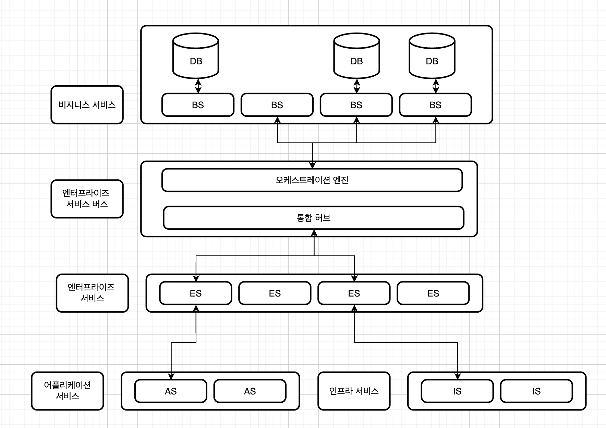
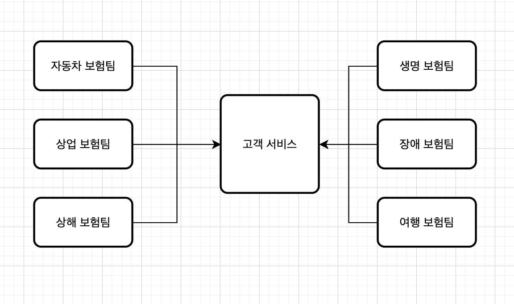

# 오케스트레이션 기반 서비스 지향 아키텍처

모든 아키텍처가 완벽하지 만은 않습니다. 우리는 아키텍처의 잘못된 역사를 알고 이를 개선해야 더 나은 설계를 구축할 수 있습니다.

실제로 오케스트레이션 아키텍처는 한 조직의 아이디어였는데 이 아이디어는 훗날 악몽으로 자리잡습니다.

*MSA의 오케스트레이션과 오케스트레이션 기반 아키텍처는 다른말입니다.*

## 역사

서비스 지향 아키텍처가 1990년대 후반에 등장 후 대기업과 중소기업의 인수 합병을 통해 빠른 속도로 성장을 하였습니다.

당시에 아키텍트들은 다양한 외부 여건의 탓에 어쩔 수 없이 제약이 많은 분산 아키텍처를 구축했습니다.

그리고 많은 라이센스 구매와 데이터베이스를 사용하다보니 최대한 재사용하는 것을 목표로 하게되었고,

모든 형태의 재사용은 이 아키텍처의 중심 철학이 되었습니다.

## 포톨로지

이 아키텍처의 핵심은 아키텍처 내부에 **서비스 텍소노미**를 정립하여 레이어별로 책임을 지운다는 아이디어는 동일합니다.

> 택소노미
>
> *엔터프라이즈 레벨의 재사용을 위해 만든 하나의 분류체계*

 

- **비지니스 서비스 역할**

  최상단에 위치한 비지니스 서비스의 진입점 역할입니다.

  이 서비스의 정의는 코드는 전혀없고 오로지 입력, 출력, 스키마 정보만 가지고 있습니다.

  일반적으로 제공을 하는 곳이며 사용은 엔터프라이즈 서비스에서 정의하여 사용합니다.

- **오케스트 레이션 엔진 역할**

  이 엔진은 분산 아키텍처의 중요핵심입니다.

  이 엔진은 비지니스 서비스 구현체를 서로 엮어주면서 트랜잭션 조정과 메시지 변환등의 핵심 기능을 수행합니다.

  일반적으로 비지니스 서비스에서는 단일 관계형 데이터베이스를 사용합니다.

  연동되는 서비스에서는 서로의 역할을 모르기 때문에 그 상위인 오케스트레이션에서 관리를 해주어야하며,

  트랜잭셔널 로직은 데이터베이스가 아닌 오케스트레이션에서 선언적으로 처리를 해야합니다.

- **엔터프라이즈 서비스 역할**

  세분화된 공유 구현체입니다.

  일반적으로 개발팀은 특정 비즈니스 도메인에 관한 행위를 여기에서 구현하게됩니다.

  보통의 엔터프라이즈 서비스는 오케스트레이션 엔진을 통해 묶인, 단위가 큰 비지니스 서비스 구성 요소들입니다.

  원래의 목적은 비지니스 서비스의 워크플로우를 재사용 하기위한 구조로 설계되었으나 이 시도는 실패로 끝났습니다.

  수십년간 솔루션이 정착된 비지니스 컴포넌트들은 본질부터 서로 달랐기 때문입니다.

  그리고 소프트웨어 간의 경쟁과 기술변화는 이 실패를 더욱 가속화 시켰습니다.

- **애플리케이션 서비스**

  아키텍처의 모든 서비스가 엔터프라이즈 서비스와 동일한 레벨의 세분화와 재사용성이 필요하지는 않습니다.

  이 서비스는 단일 구현체 서비스입니다.

  만약 위치정보 서비스를 여기서 구현하였다면 엔터프라이즈 서비스는 이 단일 애플리케이션 서비스를 따로 사용하기만 하면됩니다.

- **인프라 서비스**

  이 서비스는 모니터링, 로깅, 인증/인가 등의 운영 관심사를 지원합니다.

## 재사용

이 아키텍처의 주된 목표는 서비스 레벨의 재사용입니다.

시간이 지남에 따라 재사용 가능한 비지니스 행위를 점진적으로 구축하는것을 목표로 하며 어떻게 하든지 재사용할 기회를 찾아내도록 가르침을 받습니다.

예시를 하나들어 여기 모든팀이 사용하는 고객 서비스가 있습니다.

재사용성을 위해 모든팀에서 사용하는 고객의 서비스는 고객의 모든 행위를 하나의 고객 서비스로 분리 시켰습니다.

 

이때 이 설계의 좋지 않은점이 나타나기 시작합니다.

- 재사용 위주로 시스템을 구축하여 컴포넌트 간의 커플링(서로의 연관관계)이 심하게 발생합니다.

  이는 곧 하나의 서비스 변경이 많은 팀 서비스에 영향을 미치게 됩니다.

- 위의 결과로 심각하게 많은 테스트와 고려사항이 추가됩니다.

- 다른팀의 데이터가 부가적인 복잡성과 정의를 요구하게됩니다.

실제로 이 아키텍처의 사용은 악몽이였다고합니다.

간단히 개발자가 추가해야하는 사항에도 작은 데이터하나가 수많은 문제를 불어 일으킬수 있기 때문입니다.

후에 이 아키텍처에 반발하고자 마이크로 서비스같은 현대적인 아키텍처가 탄생합니다.

## 장단점

**장점**

- 코드의 재활용성이 높습니다.
- 가장 기술적으로 분할된 범용 아키텍처입니다.

**단점**

- 배포가 까다롭고, 하나의 테스트와 시험이 매우 오래 걸립니다.
- 서비스를 확장하고 관리하는데 매우 까다롭습니다.
- 각 비지니스 요청이 여러부분에 흩어져 있기에 성능또한 매우 형편없습니다.
- 비지니스 라이센스와 인스턴스로 많은 비용이 발생합니다.
- 심각한 커플링으로 잦은 수정과 개발 하나의 많은 리소스를 사용해야합니다.