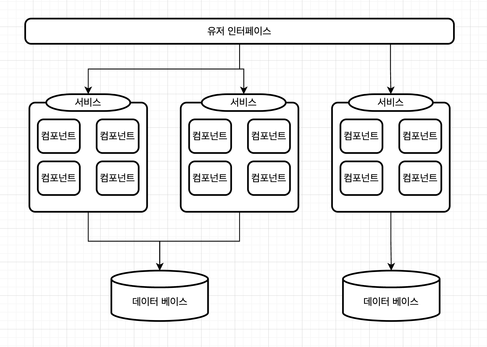

# 서비스 기반 아키텍처

마이크로 서비스 아키텍처 스타일의 일종으로, 아키텍처가 유연해서 가장 실용적인 아키텍처 스타일중 하나입니다.

이벤트 기반의 아키텍처보다 비교적 덜 복잡하고 비용이 많이 들지 않아서 많은 비지니스 관련 애플리케이션에 널리 채택됩니다.

## 토폴로지

각각 따로 배포된 유저 인터페이스(web, mobile 등)와 **분산된 서비스, 모놀리스 데이터베이스**로 이루어진 대규모 분산 레이어 구조입니다.

서비스는 큼지막한 단위로 분리되어 별도로 배포하는 **어플리케이션의 일부** 입니다.

도커 같은 컨테이너에 도메인 서비스를 담아 배포할수 있지만 컨테이너화가 필수는 아닙니다.

  

서비스 기반 아키텍처에서 서비스는 각각 단일 인스턴스로 배포하지만, 확장성, 처리량 요구사항등에 따라 인스턴스를 여럿 둘 수도있습니다.

서비스 기반 아키텍처는 **중앙 공유 데이터베이스를 사용한다**는 특징이 중요합니다.

따라서 각각의 서비스는 기존 모놀리식 레이어드 아키텍처와 동일한 방식으로 SQL 쿼리를 사용할수 있습니다.

서비스 개수가 적을경우 데이터 베이스 커넥션은 대개 문제가 안되지만 데이터베이스의 수정문과 같은경우는 이슈가 될수도 있습니다.

또한 서비스의 구성에 맞게 다양하게 변환 시킬수 있습니다.

**멀티 인터페이스**

 

**멀티 데이터베이스**

 

## 서비스 설계 및 세분도

서비스 기반 아키텍처의 도메인 서비스는 보통 단위가 크기 때문에 도메인 서비스를 레이어드 아키텍처 스타일로 설계하는 것이 일반적입니다.

서비스 설계를 하다보면 우리는 오케스트레이션에 집중을 해야합니다.

> 오케스트레이션
>
> *인터페이스를 통해 유입된 비지니스 요청을 조정, 조율 하는 역할*

어떤 요청이 들어오면 우리는 그 요청에 맞는 비지니스 로직을 수행하고 그와 연관된 다른 서비스의 처리 또한 해주어야합니다.

얼핏보면 마이크로 서비스 아키텍처와 비슷하게 보일수 있는데 세분도 관점에서 보면, 

**내부 클래스 수준의 오케스트레이션 관리와 외부 서비스(별도로 배포된 다수의 전용 원격서버)의 오케스트레이션 관리라는 차이점**에서 둘은 다른 면모를 보입니다.

도메인 서비스에서는 세분도가 크기 때문에 단일 도메인 서비스에서 데이터의 무결성을 보장하기위해 

커밋/롤백 이 수반되는 ACID (원자성, 일관성, 격리성, 지속성) 트랜젝션을 사용합니다.

마이크로 서비스 아키텍처는 특유의 높은 분산도 때문에 여기에 BASE 트랜젝션 (가용성, 소프트 상태, 최종 일관성) 이라고 알려진 분산 트랜젝션 기법을 추가로 활용합니다.

하지만 서비스 기반 아키텍처에서는 이 기반 자체가 최종 일관성이므로 ACID 트랜잭션 레벨의 무결성은 지원하지 않습니다. -> 잘 보존됩니다.

만약에 우리가 주문이라는 작업을 수행할때 만료된 카드의 경우 서비스 기반 아키텍처는 동일한 서비스 내부에서 발행한 트랜잭션 이기 때문에 

이를 롤백하고 만료된 카드라도 알려주면됩니다.

하지만 마이크로 서비스 아키텍처는 이를 주문이라는 서비스를 시행한 뒤 원격으로 존재하는 결제 서비스에 요청을 할것입니다.

결제 서비스에서의 결과가 만료된 카드의 경우 이미 시행된 주문 서비스는 비일관된 상태가 되어버립니다.

이 처럼 마이크로 서비스 아키텍처에 비해 많은 부분들이 쉬워지지만 그만큼 큰 범위의 부분을 소화하는 만큼 테스트의 범위도 커져야 하는 부분이 있습니다.

## 데이터 베이스 분할

서비스 기반의 아키텍처는 주어진 애플리케이션 콘텍스트에서 서비스 수( 보통 4~12개 ) 가 적은 편이라 단일 모놀리식 데이터베이스를 공유합니다.

데이터베이스를 공유하는 만큼 데이터 베이스의 스키마 변경은 모든 서비스의 큰 영향을 주게 됩니다.

 

스키마 변경을 더 효율적으로 관리하기위해 서비스 기반 아키텍처에서는 

전체 도메인 서비스가 함께 사용하는 커스텀 공유 라이브러리에서 관리하는것이 좋습니다.

SQL코드 또한 이 라이브러리에서 관리를 합니다.

하지만 이마저도 완벽한 해결책이 될 수는 없습니다.

이유는 단순 변경한 스키마가 어떤 서비스에 영향을 주는지 쉽게 파악하기가 어렵다는 점입니다.

서비스가 더 많이 분리될 수록 파악하기는 더욱 힘들어 질수 있습니다.

이를 해결하기위해 데이터 베이스와 서비스 간의 스키마를 논리적으로 분할을 하는 방법을 사용할수 있습니다.

 

## 사례

1. 서비스 분리가 명확한 모든 비지니스 어플리케이션

## 장단점

**장점**

- 서비스 기반의 가장 큰 장점은 많은 비지니스를 소화할 수 있는 유연성입니다.
- 개별 배포가 가능하기에 특정 서비스가 전체 서비스의 영향을 주지 않습니다.
- 서비스의 확장과 전환이 용이합니다.
- 도메인의 잦은 변경을 단일 도메인 서비스로 격리하고 소화를 하게 된다면 발빠른 대처를 할 수 있습니다.
- 도메인의 범위가 한정되어있으므로 테스트 커버리지가 향상됩니다.
- 덩치가 큰 모놀리스보다 덜 위험하게, 더 자주 배포할 수 있습니다.
- 위의 이유로 시장출시를 앞당겨 더 빨리 출시 하고 신속하게 버그를 조치할 수 있습니다.
- 분산 트랜젝션이 많이 않기 때문에 전반적으로 네트워크 측면에서 신뢰성이 좋습니다.

**단점**

- 서비스를 너무 잘게 나누면 비용적인 측면에서 효율적이지 못합니다.
- 공통화 되는 작업에 라이브러리화를 위한 추가적인 리소스가 들어갑니다.
- 

> 오케스트레이션
>
> *여러 트랜잭션의 워크플로우를 제어, 관리하는 중재자 서비스를 따로 두는 설계 방법입니다.*

>코레오그래피
>
>*각 서비스가 중앙 중재자 없이 서로가 알아서 소통하는 설계 방법입니다.*

