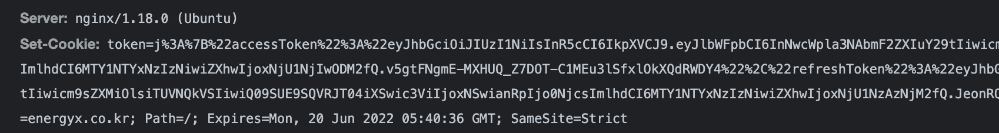
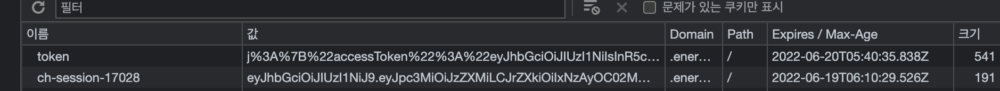

## NestJS 에서 쿠키를 설정하는 방법


쿠키는 웹(WEB)에서 서로다른 도메인간의 데이터를 주고 받기에 아주좋은 역할을 합니다.

그렇기 때문에 많은 사이트에서 각자의 목적에 맞게 쿠키를 설정하고 관리하고있습니다.

저 역시 마찬가지로 이번에 서로다른 도메인간에 로그인 토큰정보를 공유하기 위해서 쿠키를 사용하였습니다.

쿠키 설정은 서버쪽과 클라이언트쪽 둘다 진행을 해주어야 하며, 여러 가지 문제점과 네트워크 연결 부터 CORS까지

정말 많은 부분에서 저를 괴롭혔는데요. 어떻게 이런부분들을 해결했는지 정리를 하도록 하겠습니다.


### SET-COOKIE

먼저 이 명령어에 대해서 우리는 알 필요가 있습니다.



**다음과같이 Set-Cookie는 Server 쪽에서 HTTP Response에 데이터를 담아 보내게 됩니다.**

이 과정을 통해 브라우저에 우리는 Cookie를 저장할 수 있습니다.

그러면 어떻게해야 이 Set-Cookie를 해줄수 있을까요?


### REST에서 Cookie 보내기

항상 우리는 코드를 먼저 봅니다. 그게 제일 빠르니까요.

먼저 쿠키를 사용하기 위해서 우리는 Cors설정을 해주어야합니다.

```typescript
// main.ts
app.enableCors({ credentials: true, origin: true });
```

옵션을 알아보도록 할까요?

- `credentials` : 도메인간 cookie를 읽고 쓰기위해 필요한 옵션입니다.

- `origin` : 클라이언트 쪽에서 들어오는 주소로 접근 가능한 cookie인지 확인하는 whiteList 부분입니다.

  ​				true는 들어온 사이트의 주소를 접근 허용하는 옵션입니다. 실질적으로 ***** 와 같은 옵션입니다.

  ​				배열의 주소 형식(`['주소','주소']`)으로 명시적으로 제한 할수 있습니다.


Express기반 NestJS에서 Set-Cookie 설정은 이런식으로 진행할 수 있습니다.

```typescript
// auth.controller.ts

@Post('login')
  async login(
    @Body() loginDto: LoginDto, // login에 필요한 id와 password를 요구합니다.
    @Res({ passthrough: true }) res: Response, // express의 Response 타입을 사용합니다.
  ) {
    const resultToken = await this.authService.login(loginDto); // service 에서 token 을 생성합니다.
    return this.setResponseCookie(res, resultToken);
  }

setResponseCookie(res: Response, resultToken: Token): boolean {
    res.cookie('token', resultToken, {
      httpOnly: true,
      secure: true,
      sameSite: 'strict',
      domain: 'server_domain.접미사',
      maxAge: 1000 * 60 * 60 * 24,
    });
    return !!resultToken;
  }
```

하나씩 알아보도록 할까요?

- `passthrough: true` : response의 응답값을 주기 전까지 프로토콜은 클라이언트에 전송이 되지 않습니다. 
   									하지만 이 설정으로 우리는 그 부분을 생략할수 있습니다.

- `res.cookie` : response 가 가지고 있는 set-cookie를 실행합니다.

  ​						**첫번째 값은 cookie 키값**의 이름, **두번째 값은 벨류값** 의 이름 **세번째 값은 쿠키의 옵션**입니다.

- `httpOnly` : XSS 보안 취약점을 위해 만들어진 옵션입니다. 브라우저내의 document.cookie 접근을 막습니다.

- `secure` : SSL적용을 판별합니다. https 에서만 쿠키가 저장이 되도록합니다.

- `sameSite` : 도메인에서의 쿠키 사용 범위를 제한합니다. none, lax, strict 3가지 옵션이 있으며, 

  ​					chrome 이슈로 인해 none으로 적용할경우 반드시 `secure` true설정이 적용되어야합니다.

- `domain` : Server의 주소를 적어주어 CORS오류를 방지합니다.

- `maxAge` : 시간이 지나면 자동으로 쿠키를 만료시킵니다.


하지만 이정도의 세팅으로 쿠키는 저장되지 않습니다.

이유는 네~! 클라이언트에서 아무런 세팅을 해주지 않았기 때문입니다.

그러면 어떻게 클라이언트 세팅을 해주어야할까요?

만약 axios 요청을 사용한다면 다음 옵션을 기본으로 적용해야합니다.

Server쪽의 세팅과 마찬가지로 credentials 세팅을 해주어야합니다.

```javascript
import axios from 'axios';

axios.defaults.withCredentials = true; // api요청에 기본으로 쿠키값 넣기위해 사용

// 주의점은 create 하기전에 defaults 설정을 먼저 해주어야합니다!
export const axiosInstance = axios.create({
	baseURL: `${process.env.API_URL}`,
});

```

각자환경에 맞는 세팅이 있으므로 꼭 적용하도록 합시다.


그러면 다음과 같이 적용되는것을 볼수 있습니다.




쿠키를 서버쪽에서 본격적으로 읽어야 할텐데요.

어떻게 해야할까요?

왜냐하면 쿠키는 기본적으로 JSON형태의 값으로 한줄로 오기때문에 많은 쿠키가 뭉쳐지면 제대로 된 값을 가져올수 없기 때문입니다.

이에 NestJS는 다음과 같은 라이브러리를 추천합니다.

```bash
$ npm install cookie-parser
```

```typescript
// main.ts
app.use(cookieParser());
```

쿠키의 값을 javascript object 형태인 `key-value` 로 변환을 해주어 보다 쉽게 쿠키값을 코드로 옮겨올수 있습니다.


다음은 쿠키를 읽기위해 다음과 같이 NestJS strategy를 구성할수 있습니다.

```typescript
import { Request } from 'express';
import { AuthService } from '../auth.service';
import { ConfigService } from '@nestjs/config';
import { PassportStrategy } from '@nestjs/passport';
import { ExtractJwt, Strategy } from 'passport-jwt';
import { HttpException, HttpStatus, Injectable } from '@nestjs/common';
import { JwtRepository } from '@nrgx/auth/repositories';

@Injectable()
export class JwtStrategy extends PassportStrategy(Strategy) {
  constructor(
    private configService: ConfigService,
    private authService: AuthService,
    private jwtRepository: JwtRepository,
  ) {
    super({
      ignoreExpiration: true,
      secretOrKey: configService.get('secret'),
      jwtFromRequest: ExtractJwt.fromExtractors([ // cookie 값을 읽어오기위해 request에 접근합니다.
        (req: Request) => {
          const token = req?.cookies['token']; // request의 cookie에서 원하는 값을 가져옵니다.
          if (!token) {
            return null;
          }
          return token.accessToken;
        },
      ]),
    });
  }

  async validate(payload: any) {
    const foundJwt = await this.jwtRepository.findOne({
      where: { id: payload.jti },
    });
    if (!foundJwt) {
      throw new HttpException(
        {
          status: HttpStatus.UNAUTHORIZED,
          error: 'Not found jwt',
        },
        HttpStatus.UNAUTHORIZED,
      );
    }
    return {
      id: payload.sub,
      email: payload.email,
      type: foundJwt.type,
      roles: payload.roles,
      jti: foundJwt.id,
    };
  }
}

```


### 쿠키 삭제

쿠키를 읽었다면 당연하 삭제를 해주는 구문이 필요합니다.

로그인 정보가 담겨있다면 로그아웃이 될때 필요할수 있겠군요

다음과같이 소스를 구현하면 됩니다.

```typescript
@Post('logout')
@UseGuards(RefreshAuthGuard)
async logout(
    @CurrentUser() member: User,
    @Res({ passthrough: true }) res: Response,
  ) {
    return this.setResponseClearCookie(res);
 }

setResponseClearCookie(res: Response): boolean {
    res.clearCookie('token', {
      domain: 'server_domain.접미사',
    });
    return true;
 }
```

몇가지를 알아볼까요?

- `res.clearCookie` : crearCookie 메서드를 사용하면 간단하게 Cookie를 제거할수 있습니다.

- `domain` : 많은 사이트로부터 쿠키의 정보는 쌓일수 있기때문에 반드시 어떤 사이트의 쿠키를 제거할지 명시해주어야합니다.

  ​				그렇지 않으면 제대로 쿠키가 제거되지 않을수 있습니다.


### Graphql에서 Cookie 보내기

Graphql에서도 마찬가지로 쿠키를 보낼수 있습니다.

애초에 Graphql 이라는 것이 HTTP 프로토콜 통신이기 때문에 비슷한 방식으로 쿠키를 담아서 전송합니다.

먼저 `main.ts` 입니다.

```typescript
app.use(cookieParser());
app.enableCors({ credentials: true, origin: true });
```

마찬가지로 CORS 설정을 해줍니다.

다음은 `app.module.ts` 에서 `graphql` 설정 부분을 다음과 같이 수정합니다.

```typescript
GraphQLModule.forRoot({
      typePaths: ['./src/**/*.graphql'],
      resolvers: { JSON: GraphQLJSON },
      definitions: { path: join(process.cwd(), 'src/graphql.ts') },
      installSubscriptionHandlers: true,
      cors: { // CORS 설정을 main.ts와 똑같이 적용합니다.
        credentials: true,
        origin: true,
      },
      subscriptions: {
        path: '/subscription',
      },
      context: ({ req, res, con }) => { // response와 request를 모두 보내줍니다.
        if (req) {
          return { headers: req.headers, res };
        } else {
          return con;
        }
      },
      uploads: {
        maxFileSize: 40000000,
        maxFiles: 6,
      },
      playground: true,
      debug: true,
    }),
```


전에는 Express의 Response로 부터 쿠키 설정을 해주었지만 아쉽게도 Graphql은 이 부분을 

Graphql만의 방법으로 overwirte 해버립니다.

그렇기 때문에 가장 쉬운 방법으로 Context에 접근을 하여 response `set-cookie`를 하는 방법을 사용하겠습니다.

```typescript
// ... 생략
import { Args, Context, Mutation, Resolver } from '@nestjs/graphql';

@Mutation()
async login(@Args() loginArgs: LoginArgs, @Context() ctx: Context) {
    const resultToken = await this.authService.login(loginArgs);
    return this.setResponseCookie(ctx, resultToken);
}
  
setResponseCookie(ctx: Context, resultToken: Token): boolean {
    ctx.res.cookie('token', resultToken, {
      httpOnly: true,
      secure: true,
      sameSite: 'strict',
      domain: 'server_domain.접미사',
      maxAge: 1000 * 60 * 60 * 24,
    });
    return !!resultToken;
}
```


토큰을 삭제하는것도 마찬가지로 적용하면됩니다.

```typescript
// ... 생략
@Post('logout')
@UseGuards(RefreshAuthGuard)
async logout(
    @CurrentUser() member: User,
    @Context() ctx: Context,
  ) {
    return this.setResponseClearCookie(ctx);
 }

setResponseClearCookie(ctx: Context): boolean {
    ctx.res.clearCookie(this.authService.getCookieName(), {
      domain: this.configService.get('defaultDomain'),
    });
    return true;
}
```

