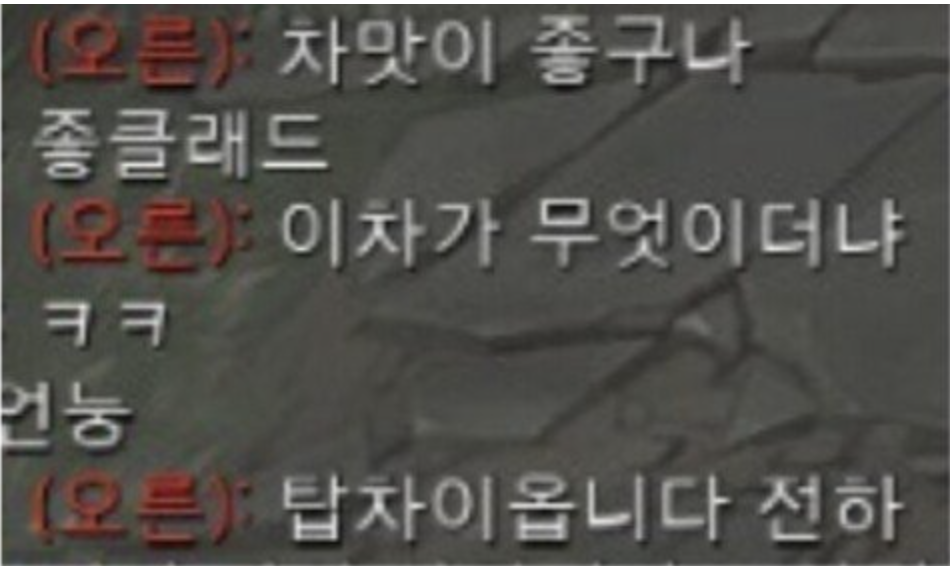

# 디버깅

---

## 디버깅이란

**디버깅**([영어](https://ko.wikipedia.org/wiki/영어): debugging) 또는 **디버그**([영어](https://ko.wikipedia.org/wiki/영어): debug)는 [컴퓨터 프로그램](https://ko.wikipedia.org/wiki/컴퓨터_프로그램) 개발 단계 중에 발생하는 시스템의 논리적인 오류나 비정상적 연산([버그](https://ko.wikipedia.org/wiki/소프트웨어_버그))을 찾아내고 그 원인을 밝히고 수정하는 작업 과정을 뜻한다. 일반적으로 디버깅을 하는 방법으로 테스트 상의 체크, 기계를 사용하는 테스트, 실제 데이터를 사용해 테스트하는 법이 있다.

[디버거](https://ko.wikipedia.org/wiki/디버거)(debugger)는 디버그를 돕는 도구이다. 디버거는 주로 원하는 코드에 [중단점](https://ko.wikipedia.org/wiki/중단점)을 지정하여 프로그램 실행을 정지하고, 메모리에 저장된 값을 살펴보며, 실행을 재개하거나, 코드를 단계적으로 실행하는 등의 동작을 한다. 고급 디버거들은 [메모리 충돌](https://ko.wikipedia.org/w/index.php?title=메모리_충돌&action=edit&redlink=1) 감지, [메모리 누수](https://ko.wikipedia.org/wiki/메모리_누수) 감지, [다중 스레드](https://ko.wikipedia.org/wiki/다중_스레드) 관리 등의 기능도 지원한다.

### 어렵게 정의되어있지만 간단히 말하자면

우리가 예상하는 또는 원하는 목표를 **명백히 정의** 하고

현재의 문제가 뭔지 **정확하게 파악**하여 

이 둘의 **갭(GAP)**을 줄여가는 과정이라고 할 수 있습니다.

 

(차이를 벌리는 나쁜 예시)

## 서론

---

좋은 디버깅과 나쁜 디버깅을 명확하게 구분하는것은 없다.

하지만 가장 중요시하는건 무엇을 목적으로 디버깅을 하는것이냐 이다.

디버깅을 하는 목적이 **로직**인지, **성능**인지, **비용**인지 디버깅을 하는 목적을 잘 결정해야 할것이다.

사실 디버깅을 하는것 만이 올바른 방법만은 아니다.

아래와 같이 

- Unit test (단위 테스트)
- Integration test (통합 테스트)
- Control flow analysis (제어 흐름 테스트)
- Log file analysis , Print Log (로그 파일 확인)
- Interactive debugging (디버깅)
- Profiling (시스템 성능 사용량 확인)

등의 방법으로도 충분히 디버깅을 할수 있다.

따라서 정해진 디버깅은 없지만 내가 맞닿은 버그에 맞게 유연하게 대처해야하는 점이 중요하다.

## 본론

---

하지만 역시 가장 많이 유용하게 사용되는 **Debugger** 에 대해 알아볼 필요가 있다.

어느 IDE 나 Debugger를 지원하며 이는 코드를 짜는 프로그래머에게 유용하게 작용할 수 있습니다.

언제나 그렇듯 모르면 손해이니까

 

**WebStorm 에서 모든 Breack Point 보기**

1. 디버거의 왼쪽 부분에 있는 **View Breakpoints**  를 클릭하거나 ⇧ ⌘ F8 를 누릅니다.

**WebStorm 에서 북마크 남기기**

1.  북마크를 위해 브래이크 포인트()와 같은 라인에서 ⌘ 누른 상태로 클릭을 합니다.

2. `Edit Bookmark description` 을 선택하여 원하는 메세지를 작성합니다.

   

**WebStorm 에서 사용하는 디버그 아이콘**

Depending on their [type](https://www.jetbrains.com/help/pycharm/using-breakpoints.html#breakpoint-types) and [status](https://www.jetbrains.com/help/pycharm/using-breakpoints.html#breakpoint-statuses), breakpoints are marked with the following icons:

|                                                      | Line                                                         | Method                                                       | Exception                                                    |
| ---------------------------------------------------- | ------------------------------------------------------------ | ------------------------------------------------------------ | ------------------------------------------------------------ |
| Regular (정의됨)                                     |  |  |  |
| Disabled (사용하지 않음)                             |  |  |  |
| Verified (확인됨)                                    |  |  |                                                              |
| Muted (무시)                                         |  |  |                                                              |
| Inactive/dependent (비활성 / 종속적)                 |  |  |                                                              |
| Muted disabled (비활성화 된 무시)                    |  |  |                                                              |
| Non-suspending (중단되지 않음)                       |  |  |                                                              |
| Verified non-suspending (확인된 일시 중단되지 않음 ) |  |  |                                                              |
| Invalid (잘못됨)                                     |  |                                                              |                                                              |

**WebStorm 에서 사용하는 디버그 아이콘 의 정의**

| 상태               | 설명                                                         |
| ------------------ | ------------------------------------------------------------ |
| Verified           | 디버거 세션을 시작한 후 디버거는 중단점에서 프로그램을 일시 중단하는 것이 기술적으로 가능한지 여부를 확인합니다. 그렇다면 디버거는 중단점을 *확인 됨*으로 표시합니다 . |
| Warning            | 기술적으로 중단점에서 프로그램을 일시 중단하는 것이 가능하지만 이와 관련된 문제가 있는 경우 디버거에서 *경고를 표시* 합니다. 예를 들어 메서드 구현 중 하나에서 프로그램을 일시 중단하는 것이 불가능한 경우에 발생할 수 있습니다. |
| Invalid            | 중단점에서 프로그램을 일시 중단하는 것이 기술적으로 불가능한 경우 디버거는 이를 *잘못된* 것으로 표시합니다 . 가장 일반적인 원인은 라인에 실행 가능한 코드가 없기 때문입니다. |
| Inactive/dependent | 중단점이 다른 중단점에 도달할 때까지 비활성화되도록 구성된 경우 중단점은 비활성/종속으로 표시되며 이는 아직 발생하지 않았습니다. |
| Muted              | 모든 중단점은 [무시](https://www.jetbrains.com/help/pycharm/using-breakpoints.html#mute) 되었기 때문에 일시적으로 비활성화 [됩니다](https://www.jetbrains.com/help/pycharm/using-breakpoints.html#mute) . |
| Disabled           | 비 활성화 되었기 때문에 이 브레이크 포인트에서는이 일시적으로 [사용할 수 없습니다](https://www.jetbrains.com/help/pycharm/using-breakpoints.html#disable) . |
| Non-suspending     | 이 [중단](https://www.jetbrains.com/help/pycharm/using-breakpoints.html#suspend_policy) 점에 대해 [중단 정책](https://www.jetbrains.com/help/pycharm/using-breakpoints.html#suspend_policy) 이 설정되어 적중 시 실행을 중단하지 않습니다. |

## 마치며

---

저에게는 console 이 가장 쉬운 개발 디버깅이라고 생각했습니다.

하지만 이렇게 공부를 하고, 찾아본 후의 생각은 정말 세상에는 내가 모르는게 많다는 것 이였습니다.

항상 영감과 깨달음을 주고, 도와주시는 우리 백엔드 개발자 분들 감사합니다.

 

