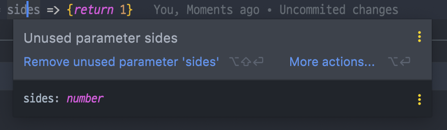

# 이팩티브 타입스크립트

Effective TypeScript를 읽으며 배운점과 느낀점을 정리합니다.

---


## Item 1.

### *타입스크립트와 자바스크립트의 관계 이해하기*

타입스크립트와 자바스크립트와 관계는 서로 상호호환적이지만 타입스크립트를 자바스크립트가 완전하게 호환할수는 없다.


### 요약

타입스크립트는 자바스크립트의 상위집합(SuperSet)이다.

> - 타입스크립트는 문법적으로도 자바스크립트의 상위 집합니다.
>- 어떤 이슈가 존재한다면 문법오류가 아니라도 타입체커에 지적당할 가능성이 높다.
> - 그러나 문법의 유효성과 동작의 이슈는 독립적인 문제이다.
> - 자바스크립트는 js 또는 jsx 를 사용하지만 타입스크립트는 ts 또는 tsx를 사용한다.
> - Main.js 를 Main.ts로 바꾸어도 아무런 문제가 되지않는다. 
>   이는 JS 를 TS로 마이그래이션하는 과정에서 엄청난 이점으로 작용된다.
> - 반대로 모든 TS파일이 JS로 바뀌어 질수는 없습니다.
> - 타입스크립트는 초깃값으로부터 타입을 추론합니다.


## Item 2.

### *타입스크립트 설정 이해하기*

타입스크립트의 장점은 타이트한 문법과 타입체크에 있다. 이것이 지켜질때 타입스크립트는 강하며, 이것이 없어질수록 타입스크립트는 한없이 약해진다.


### 요약

타입 스크립트에서 컴파일 하는 방식이다.

> - 타입스크립트 컴파일러는 언어의 핵심 요소에 영향을 미치는 몇 가지 설정을 포함하고있다.
> - 타입스크립트 설정은 커맨드 라인을 이용하기보다는 tsconfig.json 을 사용하는 것이 좋다.
> - 자바스크립트 프로젝트를 타입스크립트로 전환하는게 아니라면 noImplicitAny(any타입 금지)를 설정하는것이 좋다.
> - "`undefined`는 객체가 아닙니다." 라는 오류를 방지하기 위해 strictNullCheck를 설정하는것이 좋다.
> - 타입스크립트에서 엄격한 체크를 하고 싶다면 strict설정을 고려해야한다.


## Item 3.

### *코드 생성과 타입이 관계없음을 이해하기*

타입스크립트의 크게 두가지 역할은 **최신 브라우저에서 동작하도록 구버전의 자바스크립트 코드를 컴파일합니다.** 와 **코드의 타입 오류를 체크합니다.**

그리고 이 두가지 역할은 완벽하게 서로 독립적입니다.

>코드에 오류가 있을때 "컴파일에 문제가 있습니다." 라는 문구는 타입스크립트에서 정확하게는 틀린말이 됩니다.
>
>오직 코드 생성만이 "컴파일"이 될 수 있기때문입니다. 정확하게는 "타입 체크에 문제가 있다."가 올바른 표현입니다.


### 요약

타입스크립트는 컴파일과 타입체크를 별도로 구분합니다.

> - 코드 생성은 타입 시스템과 무관합니다. 타입스크립트 타입은 런타임 동작이나 성능에 영향을 주지않는다.
> - 타입 오류가 존재하더라도 코드 생성(컴파일)은 가능하다.
> - 타입스크립트 타입은 런타임에 사용할 수 없다. 런타임에 타입을 지정하려면, 타입 정보 유지를 위한 별도의 방법이 필요하다.
> - 클래스 같이 타입스크립트 타입과 런타임 값, 둘 다 제공하는 방법이 있다.


## Item 4.

### *구조적 타이핑에 익숙해지기*

자바스크립트는 본질적으로 덕 타이핑기반이다. 

만약 어떤 함수의 매개변수 값이 모두 제대로 주어진다면, 그 값이 어떻게 만들어졌는지 신경 쓰지 않고 사용한다.

>**덕 타이핑(Duck Typing)**
>
>객체가 어떤 타입에 부합하는 변수와 메서드를 가질경우 객체를 해당하는 타입에 속하는 것으로 간주되는 방식
>
>대표적인 언어로 JavaScript, Python, C++ 과같은 동적언어가 해당된다.
>
>"만약 어떤 새가 오리처럼 걷고, 헤엄치고, 꽥꽥거리는 소리를 낸다면 나는 그 새를 오리라고 부를것이다."


### 요약

타입 스크립트의 구조적 타이핑

>- 자바스크립트가 덕 타이핑 기반이고 타입스크립트가 이를 모델링하기 위해 구조적 타이핑을 사용함을 이해해야한다. 어떤 인터페이스에 할당 가능한 값이라면 타입 선언에 명시적으로 나열된 속석들을 가지고 있을것이다. 타입은 '봉인'되어 있지 않다.
>- 클래스 역시 구조적 타이핑 규칙을 따른다는것을 명심하자. 클래스의 인스턴스가 예상과는 다를수 있다.
>- 구조적 타이핑을 사용하며 유닛테스트를 손쉽게 할 수 있다.


## Item 5.

### *Any 타입 지양하기*

타입스크립트의 타입 시스템은 점진적(gradual) 적이고, 선택적(optional)이다. 그리고 이것은 any로 인해 효과적일수도 엉망일수도있다.

any타입에는 타입의 안전성이 없다. 이유는 **불확실** 하기 때문이다.

any는 함수의 시그니처를 무시한다. 보내는 타입을 정하고 반환하는 타입을 정했지만 any는 이를 무시한다.

언어 서비스를 무시하지 않아야 나와 동료의 생산성이 향상된다.

any는 타입 설계를 감춥니다. 이에따라 타입시스템의 신뢰도를 떨어트린다.


### 요약

any 타입은 편하지만 점점 코드를 파괴합니다.

>- any타입을 사용하면 타입 체커와 타입스크립트의 언어 서비스를 무력화시킨다. 
>- any 타입은 진짜 문제점을 감추며, 개발 경험을 나쁘게 하고, 타입 시스템의 신뢰도를 떨어트린다.
>- 최대한 사용을 기피하도록 하자.


## Item 6.

### *편집기를 사용하여 타입 시스템 탐색하기*

타입스크립트를 설치하면 다음 두가지를 실행할수있다.

- 타입스크립트 컴파일러 (tsc)
- 단독으로 실행가능한 타입스크립트 서버 (tsserver)

타입스크립트는 서버는 항상 편집기에서 실행하는것이 좋으며, 자동완성, 리팩터링, 추론, 검사, 검색등에서 탁월한 효과가있다.

>자바스크립트에서 `null` 은 `object` 타입입니다.

### 요약

any 타입은 편하지만 점점 코드를 파괴합니다.

>- 편집기에서 타입스크립트 언어 서비스를 적극 활용해야한다.
>- 편집기를 사용하면 어떨게 타입 시스템이 동작하는지, 그리고 타입 스크립트가 어떨게 타입을 추론하는지 개념을 잡을 수 있다.
>- 타입스크립트가 동작을 어떻게 모델링하는지 알기 위해 타입 선언 파일을 찾아보는 방법을 터득해야한다.


## Item 7.

### *타입이 값들의 집합이라고 생각하기*

타입스크립트에서 가장 작은 집합부터 나열을 해보면 이런순서가 나온다.

- never : 할당할 수 없음

>타입스크립트에서 `never` 타입은 공집합이기 때문에 아무것도 할당 할수 없습니다.
>
>```typescript
>const x : never = 12;
>// error : 12 형식은 never 형식에 할당할 수 없습니다.
>```

- Unit 또는 Literal : 하나의 값만 포함

  >하나의 값만 받을수 있습니다.
  >
  >```typescript
  >type A = 'A';
  >type Twelve = 12;
  >```
  >
  >두 개 혹은 세개로 묶으러면 유니온(Union)을 사용하면 된다,
  >
  >```typescript
  >// 유니온 타입은 집합들의 합집합을 의미합니다.
  >type AB = 'A' | 'B';
  >type AB12 = 'A' | 'B' | '12';
  >```

- Identified : 타입의 전부

  >타입의 전부는 `number`, `string`으로 구분할수 있습니다.
  >
  >구조적 타이핑의 규칙에따라 어떠한 값이 다른 속성도 가질 수 있음을 의미합니다.
  >
  >```typescript
  >interface Person {
  >  name: string;
  >}
  >
  >interface Life {
  >  birth: Date;
  >  death?: Date;
  >}
  >
  >// & 연산자는 두 타입의 인터섹션(교집합)을 계산합니다.
  >// 언뜻 보기에 두 값이 (Person, Life) 공통되는 것이 없기에 never타입일것 같지만
  >// 타입 연산자는 인터페이스의 속성이 아닌, 값의 집합 (타입의 범위)에 적용이 됩니다.
  >type PersonSpan = Person & Life;
  >
  >// 정상
  >const ps : PersonSpan = {
  >  name : 'dan',
  >  birth : new Date('1993-05-01')
  >  death : new Date('2100-05-01')
  >};
  >
  >// 유니온 타입으로 묶을경우 never 타입이 됩니다.
  >type NeverType = Person | Life;
  >```
  >
  >위에 헷갈리는 부분을 조금 더 쉽게 표현한것이 `extends` 이다.
  >
  >```typescript
  >interface Person {
  >  name: string;
  >}
  >
  >// extends는 ~에 할당 가능한, ~의 부분 집합의 의미가 있습니다.
  >interface Life extends Person {
  >  birth: Date;
  >  death?: Date;
  >}
  >```
  >
  >


### 요약

>- 타입을 집합으로 생각하면 이해하기 편하다. (타입의 '범위') 
>  이 집합은 유한하거나 (`Boolean` 또는 `리터럴` 타입) 무한하다 (`String`,` Number`).
>
>- 타입스크립트 타입은 엄격한 상속 관계가 아니라 겹쳐지는 집합(벤다이어 그램)으로 표현된다. 
>  두 타입은 서로 서브타입이 아니면서도 겹쳐질 수 있다.
>
>- 한 객체의 추가적인 속성이 타입 선언에 언급되지 않더라도 그 타입에 속할 수 있다.
>
>- 타입 연산은 집합의 범위에 적용된다. A와 B의 인터섹션은 A의 범위와 B범위의 인터섹션이다.
>
>- 객체 타입에서 A&B인 값은 A와 B의 모든 속성을 가진다는것을 의미한다.
>
>  그리고 extends또한 같은 의미이다.


## Item 8.

### *타입 공간과 값 공간의 심벌 구분하기*

타입스크립트의 심벌은 타입 공간이나 값 공간 중의 한곳에 존재한다.

```typescript
// 아래 함수와 타입은 이름은 같지만 서로 아무런 관계도 없습니다.

interface Cylinder {
  radius : number;
  height : number;
}

const Cylinder = (radius: number, height: number) => ({radius, height})

// instanceof는 자바스크립트의 런타임 연산자입니다.
// instanceof는 아래 함수에서 연산을 하려하고 이는 타입이 아닌 함수 형식으로 인식을 합니다.
// 따라서 인식하지 못하는 에러가 발생합니다.
function volume(shape : unknown) {
  if (shape instanceof Cylinder) {
    shape.radius // error {} 형식에 radius가 존재하지 않습니다.
  }
}
```

>타입 스크립트에서 타입 선언은 `:` 을 사용합니다.
>타입의 대한 단언은 `as` 를 이용합니다.

위의 예제에서 발생한 문제로 우리는 `enum` 또는 `class` 형식으로 타입을 만들거나 초기값을 주어 문제를 해결할 수 있습니다.

```typescript
// 클래스에서 타입으로 쓰일때는 형태 (속성, 메스드)가 사용됩니다. => 연산시 함수로 인식
// 값으로 쓰일때는 생성자가 사용됩니다. => 연산시 값으로 인식

class Cylinder {
  radius = 1;
  height = 1;
}

function volume(shape : unknown) {
  if (shape instanceof Cylinder) {
    shape.radius // 정상
  }
}

```

> `instanceof` 외에도 `typeof` 또한 같은 방식으로 동작하는 자바스크립트 런타임 연산자입니다.
>
> 하지만 `class` 에 대한 `typeof`는 상황에 따라 다르게 동작합니다.

```typescript
const v = typeof Cylinder;  // 값이 "function"
type T = typeof Cylinder;   // 타입이 typeof Cylinder

// 클래스는 자바스크립트에서 실제 함수로 구현이 되기때문에 첫번째 값은 function type입니다.

// 타입스크립트에서 class Cylinder는 인스턴스 타입이 아닙니다.
// 따라서 2번째 값은 new 를 해야만 받아볼 수 있는 타입입니다. (현재는 typeof Cylinder라는 말도안되는 타입으로 나옴)
// 결과값을 위해 선언을 해줍니다.

declare let fn : T;
const result : new fn(); // 타입이 Cylinder (정상적으로 타입이 나옴)

// 또는 InstanceType 제너릭을 사용하여 생성자 타입을 인스턴스 타입으로 전환해줄수 있습니다.

type C = InstanceType<typeof Cylinder>; // 타입이 Cylinder (정상적으로 타입이 나옴)
```


속성접근자 [ ] 는 타입으로 쓰일때에도 동일하게 동작합니다.

```typescript
// obj['field'] 와 obj.field는 값이 같더라도 타입이 다를수 있습니다.
// 그래서 타입으로 활용될때는 [ ] 접근자를 사용하는것이 좋습니다.

type PersonEl = Person['first'|'last']; // 타입은 string

type Tuple = [string, number, Date];
type TupleEl = Tuple[number]; // 타입은 string | number | Date
```


### 요약

>- 타입스크립트 코드를 읽을 때 타입인지 값인지 구분하는 방법을 터득해야한다.
>  타입스크립트 플레이그라운드를 활용해 개념을 잡는 것이 좋다.
>- 모든 값은 타입을 가지지만, 타입은 값을 가지지 않는다. 
>  type과 interface같은 키워드는 타입 공간에만 존재한다.
>- class나 enum같은 키워드는 타입과 값 두가지로 사용될 수 있다.
>- "foo" 는 문자열 리터럴이거나, 문자열 리터럴 타입일 수 있다.
>  차이점을 알고 구별하는 방법을 터득해야한다.
>- Typeof, this 그리고 많은 다른 연산자들과 키워드들은 타입 공간과 값 공간에서 다른 목적으로 사용될 수 있다.


## Item 9.

### *타입 단언보다는 타입 선언을 사용하기*

타입스크립트에서 변수에 값을 할당하고 타입을 부여하는 방법은 두 가지이다.

```typescript
interface Person { name : string };

// 타입을 선언합니다.
const alice: Person = { name: 'Alice' }; // 타입은 Person

// 타입을 단언합니다.
const bob = { name: 'Bob' } as Person;   // 타입은 Person
```

두가지 방법은 결과가 같아 보이지만 전혀 그렇지 않다.

첫번째 방법은 타입을 선언 하였기 때문에 다음과같이 코드를 작성할경우 에러가 발생한다.

```typescript
const alice: Person = { }; // name이 존재하지 않습니다.
```

하지만 단언을 할경우 에러가 발생하지 않고 Person으로 단언한다.

```typescript
const bob = { } as Person;   // 정상
```

위와 같이 타입 단언은 타입을 강제로 지정했으니 타입체커에 이를 무시하라고 말한다.

이는 속성을 추가할때 또한 마찬가지이다.

```typescript
const alice : Person = {
  name : 'Alice',
  age : 18 // 개체 리터럴은 알려진 속성만 지정할수 있으며 'Person' 속성에는 'age'가 없습니다.
 }

const bob = {
  name : 'Bob',
  age : 20
} as Person; // 정상
```

>타입스크립트에서 이런코드를 본적이 있을것이다.
>
>```typescript
>const bob = <Person>{ };
>```
>
>이는 단언문과 같은 문법이기도 하다.
>
>```typescript
>const bob = { } as Person;
>```
>
>하지만 리엑트 컴포넌트 태그로 인식되어 현재는 잘 사용하지 않는다고한다.


그러면 선언을 위주로 사용하지만 **단언문은 어디서 사용하면 좋을까?**

- DOM 엘리먼트에 사용하기

  >타입스크립트는 DOM에 접근 할수 없기때문에 #myButton이 button 인줄 모릅니다.
  >
  >따라서 이런식으로 단언문으로 지정해 줄 수 있습니다.
  >
  >```typescript
  >document.querySelector('#myButton').addEventListner('click', e => {
  >  e.currentTarget
  >  const button = e.currentTarget as HTMLButtonElement;
  >  button
  >})
  >```

- 자주쓰이는 특별한 문법( ! ) 을 사용하여 null이 아님을 단언하는 경우

  >변수의 접두사로 쓰인 ! 는 boolean의 부정문이다. 그러나 접미사로 쓰인 ! 는 그 값이 null이 아니라는 단언문으로 해석된다.
  >
  >! 는 일반적인 단언문으로 해석해야 하며 이는 컴파일 과정에서 제거되어 타입체커에서 알 수 없으므로 반드시 **null이 아니라고**
  >
  >**확실하는곳에서 사용해야한다**.
  >
  >```typescript
  >const elNull = document.getElementById('foo');
  >const el = document.getElementById('foo')!;
  >```


단언문은 모든 서브 타입에 동작을하며 관계가 없지않는 이상 에러를 발생하지 않는다.

하지만 관계가 없는 타입을 단언하려면 `unknown` 을 사용하면된다.

`unknown` 은 모든 타입의 서브 타입이기 때문이다.

하지만 이는 무언가 위험한 동작을 하고있다는것을 알아야 한다.

```typescript
const el = document.body as unknown as Person; // 정상
```

### 요약

>- 타입 단언 ( as Type ) 보다 타입 선언 ( : Type ) 을 사용해야한다.
>- 화살표 함수의 반환 타입을 명시하는 방법을 터득해야한다.
>- 타입스크립트보다 타입 정보를 더 잘 알고 있는 상황에서는 타입 단언문과 null 아님 ( ! ) 단언문을 사용한다.


## Item 10.

### 객체 래퍼 타입 피하기

자바스크립트 객체에는 객체 이외에도 기본형 값들에 대한 일곱 가지 타입

 (`string`, `number`, `boolean`,`null`,`undefined`,`simbol`,`bigint`)이 있다. 

>`string`, `number`, `boolean`,`null` 초창기부터 존재했으며,
>
>`simbol`,`bigint` 는 ES2015 에서 추가되었다.

보통 기본형은 불면이며 메서드를 가지지 않는다는 점에서 객체와 구분이된다.

하지만 string의 경우는 메서드를 가지고 있는 것 처럼 보인다.

```typescript
'primitive'.charAt(3)
// "m"
```

하지만 charAt은 string의 메서드가 아니라 객체인 `String` 타입에 정의되어있는 함수를 호출하게된다.

string같은 기본형에서 charAt같은 메서드를 사용할 때, 자바스크립트는 기본형을 String객체로 래핑(wrap)하고,

매서드를 호출하고, 마지막에 래핑한 객체를 버립니다.

만약 String.prototype을 몽키-패치 한다면 위의 내부동작을 관찰 할 수 있다.

위와 같은 식으로 몇가지 타입에는 래퍼 타입이 있습니다.

```typescript
// string => String
// number => Number
// boolean => Boolean
// symbol => Symbol
// bigint => Bigint
null 과 undefined 에는 객체 래퍼가 없습니다.
```


### 요약

타입스크립트는 자바스크립트의 상위집합(SuperSet)이다.

> - 기본형 값에 메서드를 제공하기 위해 객체 래퍼 타입이 어떻게 쓰이는지 이해하자.
> - 직접 사용하거나 인스턴스를 생성하는것은 피하도록하자!
> - 타입 스크립트 객체 래퍼타입은 지양하고, 대신 기본형 타입을 사용해야한다.
> - `String` 대신 `string`,  `Number` 대신 `number`, `Boolean` 대신 `boolean`, 
>   `Symbol` 대신 `symbol`, `Bigint` 대신 `bigint`를 사용하도록 하자.


### 심볼 (Symbol) 이란?

>1997년 자바스크립트가 ECMAScript로 처음 표준화된 이래로 자바스크립트는 6개의 타입을 가지고 있었다.
>
>- 원시 타입 (primitive data type)
>  - Boolean
>  - null
>  - undefined
>  - Number
>  - String
>- 객체 타입 (Object type)
>  - Object
>
>심볼(symbol)은 ES6에서 새롭게 추가된 7번째 타입으로 변경 불가능한 원시 타입의 값이다. 심볼은 주로 이름의 충돌 위험이 없는 유일한 객체의 프로퍼티 키(property key)를 만들기 위해 사용한다.

### 빅인트 (BigInt) 란?

>`BigInt`는 길이의 제약 없이 정수를 다룰 수 있게 해주는 숫자형이다.
>
>정수 리터럴 끝에 `n`을 붙이거나 함수 `BigInt`를 호출하면 문자열이나 숫자를 가지고 `BigInt` 타입의 값을 만들 수 있다.
>
>```typescript
>const bigint = 1234567890123456789012345678901234567890n;
>
>const sameBigint = BigInt("1234567890123456789012345678901234567890");
>
>const bigintFromNumber = BigInt(10); // 10n과 동일합니다.
>```
>
>단항 연산자를 제외한 나머지 문법은 Number와 같이 동작합니다. ( `+`,` -`,` *`,` %`, `/`, `<`, `>` 등등.. ) 
>
>```typescript
>// 단항 덧셈 연산자 +value를 사용하면 value를 손쉽게 숫자형으로 바꿀 수 있습니다.
>
>// 그런데 혼란을 방지하기 위해 bigint를 대상으로 하는 연산에선 단항 덧셈 연산자를 지원하지 않습니다.
>
>let bigint = 1n;
>
>alert( +bigint ); // 에러
>```
>
>


## Item 11.

### *잉여 속성 체크의 한계 인지하기*

타입이 명시된 변수에 객체 리터럴을 할당할 때 타입스크립트는 해당 타입의 속성이 있는지, 그리고 **그 외의 속성은 없는지** 확인을 한다.

```typescript
interface House {
  room : number;
  restRoom : number;
}

const h: House = {
  room : 3,
  restRoom : 1,
  cat : 3 // 개체 리터럴은 알려진 속성만 지정할 수 있으며 'House' 형식에는 'cat' 이 없습니다.
}
```

하지만 위의 내용은 구조적 타이핑에서는 에러가 발생하지 않아야 한다.

아래와 같은 오브젝트 타입에는 적용이 잘 됩니다.

```typescript
const obj = {
	room : 3,
  restRoom : 1,
  cat : 3
}

const h: House = obj; // 정상
```

위와같은 오류는 타입스크립트 타입체커의 `잉여 속성 체크`가 수행을하는데 이 역시 조건에 따라 동작하지 않는다는 한계가 있고,

통상적인 할당 가능 검사와 함께 쓰이면 구조적 타이핑이 무엇인지 혼란스러워질 수 있다.

**그래서 우리는** `잉여 속성 체크` **와** `할당 가능 검사`는 **별도의 과정이다.** 라는것을 알아야 타입시스템에 대한 개념을 정확히 잡을 수 있다.

그리고 `잉여 속성 체크`는 단언문에서도 적용이 되지 않는다.

```typescript
const h = { room : 3, restroom: 1, cat: 3 } as House;
```

잉여 속성 체크는 구조적 타이핑 시스템에서 허용되는 속성 이름의 오타 같은 실수를 잡는 데 효과적인 방법이다.


### 요약

> - 객체 **리터럴을 변수에 할당**하거나 **함수에 매개변수로 전달**할 때 잉여 속성 체크가 수행된다.
> - 잉여 속성 체크는 오류를 찾는 효과적인 방법이지만, 타입스크립트 타입 체커가 수행하는 일반적인 구조할당 가능성 체크와는 
>   역할이 다르다. 할당의 개념을 정확히 알아야 잉여 속성 체크와 일반적인 구조적 할당 가능성 체크를 구분할 수 있다.
> - 잉여 속성 체크에는 한계가 있다. 임시 변수를 도입하면 잉여 속성 체크를 건너뛸 수 있다는 점을 기억해야한다.


## Item 12.

### *함수 표현식에 타입 적용하기*

타입스크립트 및 자바스크립트에서는 함수 `statement(문장)` 과 함수 `expression(표현)` 을 다르게 인식한다.

```typescript
function rollDice1(sides: number):number {/* 내용 생략 */} // 문장
const rollDice2 = function(sides : number) : number {/* 내용 생략 */} // 표현식
const rollDice3 = (sides:number) : number => {/* 내용 생략 */} // 표현식
```

타입스크립트에서는 함수 표현식을 사용하는 것이 좋다.

함수의 매개변수 부터 반환값까지 전체를 함수 타입으로 선언하여 함수 표현식에 재사용할 수 있다는 장점이 있기 때문이다.

```typescript
type DiceRollFn = (sides: number) => number;
const rollDice: DiceRollFn = sides => {/* 내용 생략 */}
```

마우스로 sides 에 올려보면 이미 타입을 `number`로 인식하였음이 보인다.



이와 비슷한 예제로 HTTP fetch함수의 타입을 재정의 해보자.

```typescript
// 함수의 시그니처를 그대로 참조할때 typeof fn을 사용하면 좋다.
const checkFetch: typeof fetch = async (input, init) => {
  const response = await fetch(input, init);

  if (!response.ok) {
    throw new Error('Request failed: ' + response.status);
  }
  return response;
};
```


### 요약

>- 매개변수나 반환 값에 타입을 명시하기보다는 함수 표현식 전체에 타입 구문을 적용하는것이 좋다.
>- 만약 같은 타입 시그니처를 반복적으로 작성한 코드가 있다면 함수 타입을 분리해 내거나 이미 존재하는 타입을 찾아보도록하자.
>- 라이브러리를 직접 만든다면 공통 콜백에 타입을 제공하도록 하자.
>- **다른 함수의 시그니처를 참조하려면** `typeof fn`을 사용하자.


## Item 13.

### *타입과 인터페이스의 차이점 알기*

타입 스크립트에서 명명된 타입을 지정하는 방법은 2가지가 있다.

```typescript
// 타입으로 만들기
type Tstate = {
  name: string;
  capital: string;
};

// 인터페이스로 만들기
interface Istate {
  name: string;
  capital: string;
}

// 클래스로 타입을 지정할 수 있지만 값(item8)을 가지고 있으므로 제외

```

둘의 사용은 매우 비슷하기때문에 이를 분간하려면 둘사이에 존재하는 차이를 분명히 알아야한다.

먼저 둘의 비슷한점 부터 알아보도록하자!

1. **인덱스 시그니처 사용가능**

```typescript
type Tstate = {
  [key: string]: string;
};

interface Istate {
  [key: string]: string;
}
```

2. **함수 타입 정의 가능**

```typescript
type Tfn = (x: number) => string;

interface Ifn { (x: number): string; }
```

3. **제네릭 사용 가능**

```typescript
type Tpair<T> = {
  first: string;
  second: string;
};

interface Ipair<T> {
  first: string;
  second: string;
}
```

4. **호출 가능한 객체 함수**

```typescript
type TfnWithProprties = {
  (x: number): string;
  prop: string;
};

interface IfnWithProperties {
  (x: number): string;
  prop: string;
}
```

5. **타입 확장**

```typescript
type Tstate = {
  name: string;
};

interface Istate {
  age: number;
}

// 복잡한 union 타입 확장 가능.
type Textends = Istate & { name: string };

// 주의점! 복잡한 union 타입은 확장할 수 없다.
interface Iextends extends Tstate {
  age: number;
} 

const Test: Textends = {
  name: 'dan',
  age: 1,
}; // 정상

const Iest: Iextends = {
    name: 'dan',
    age: 1,
}; // 정상
```

6. **클래스 구현**

```typescript
type Tstate = {
  name: string;
};

interface Istate {
  age: number;
}

class StateT implements Tstate {
  name: 'dan';
}

class StateI implements Istate {
  age: 1;
}
```


다음은 차이점이다.

1. **Type의 Union 타입 확장**

```typescript
type AorB = 'a' | 'b';

interface BorA {
    // 불가능
}
```

2. **Type의 간결한 문법**

```typescript
// 타입으로 배열의 타입을 정의 할경우
type TPair = [number, number];
// 인터페이스로 배열의 타입을 정의할경우
interface IPair {
  0: number;
  1: number;
  length: 2;
}

// 더 많은 예제
type StringList = string;
type NameNums = [string, ...number[]];
```

3. **Interface의 보강 기능**

```typescript
interface Istate {
  name: string;
  age: number;
}

interface Istate {
  language: string;
}

// 따로 선언을 하지 않아도 같은 이름이면 보강이됩니다.
const person: Istate = {
  name: 'dan',
  age: 22,
  language: 'typescript',
};
```


이 와같은 차이점과 공통점으로 우리는 어떤것이 더 좋은 타입 설정인지 판가름 해야한다.

예를 들어 프로젝트의 타입이 복잡하다면 고민하지 않고, Type을 사용하는것이 좋을것이다.

보강가능성이 있다면 당연히 우리는 Interface를 사용해야 할것이다.

만약 API 데이터에 대한 타입을 지정할 때는 Interface가 더 효율적이다.

이유는 데이터가 변경될때 보강을 활용하면 매우 편리하게 데이터를 정의 할수 있기 때문이다.

하지만 내부적으로 사용되는 타입에 선언 병합이 발생하는것은 잘못된 것이기에 이때는 Type을 더 추천하는 바이다.


### 요약

> - 타입과 인터페이스의 차이점과 비슷한 점을 이해하자
> - 한 타입을 type과 interface 두 가지 문법을 사용해서 작성하는 방법을 터득하자
> - 프로젝트에서 어떤 문법을 사용할지 결정할 때 한가지 일관된 스타일을 확립하고, 보강기법이 필요한지 고려하자.


