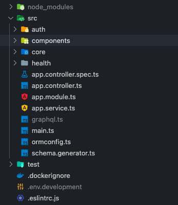

## tsconfig.json 생성

```jsx
$ tsc --init 
```

해당 키워드를 사용해서 tsconfig를 생성하면 기본적으로 세팅과 함께

다양한 옵션들이 있는 것을 확인할 수 있다.

폴더에 tsconfig.json이 있을 경우 tsc -w 키워드만을 사용해도 폴더 내부에 있는

타입스크립트 파일들을 자바스크립트로 컴파일 해준다.


## 프로젝트 구조 정리하기

1번 단계가 끝난 후 tsc -w를 실행시켜보면 컴파일된 자바스크립트 파일들과

타입스크립트 파일들이 같은 폴더에 함께 존재하는 것을 볼 수 있다.

```jsx
0-config
|__tsconfig.json
|__src
|  |__main.ts
|  |__"main.js"
|__logging
|  |__logging.ts
|  |__"logging.js"
```

이렇게 되면 타입스크립트 로직을 자바스크립트에 직접 작성하거나,

파일의 구조가 복잡해 지기 때문에 구조를 정리해줘야 한다.

tsconfig.json에 다음과 같은 옵션을 추가해주면?!

```jsx
"outDir" : "./<자바스크립트로 컴파일 되는 파일들이 저장되어지는 경로>"

ex) "outDir" : "./build"

0-config
|__tsconfig.json
|__src
|  |__main.ts
|__logging
|  |__logging.ts
|__"build" ["outDir":"./build" 설정으로 인해서 컴파일된 파일이 build에 들어감]
|  |__src 
|     |__main.js
|  |__logging
|     |__logging.js
```

위에 파일은 단순 예시 대부분 src안에 컴포넌트들을 정리해서 넣는 것이 일반적!

build 폴더를 확인해보면 자바스크립트로 컴파일된 폴더와 파일들의 구조가 동일하게 정리된다.


## 파일스크립트 파일생성 폴더 제한하기

```jsx
"rootDir" : "./<타입스크립트 파일을 생성할 수 있는 범위 설정>"

ex) "rootDir" : "./src"

0-config
|__tsconfig.json
|__src
| |__main.ts
| |__logging.ts
| |__Hi.ts
|__"build" 
   |__main.js
   |__logging.js
   |__Hi.js

--------------설정한 후 타입스크립트 파일을 src가 아닌 다른 곳에 두었을 때---------------

0-config
|__Hi.ts
|__"Hi.js"
|__tsconfig.json
|__src
| |__main.ts
| |__logging.ts
|__build 
  |__"main.ts"
  |__"logging.ts"

* 다음과 같이 지정을 해주면 src외 다른 최상위 폴더에서 타입스크립트 파일을 생성했을 때, 에러를 출력해준다.

error TS6059: File '/Users/tate/Desktop/study/Typescript-with-Ellie/0-Config/Hi.ts' is 
not under 'rootDir' '/Users/tate/Desktop/study/Typescript-with-Ellie/0-Config/src'. 'rootDir' is expected to contain all source files.
The file is in the program because:
Matched by include pattern '**/*' in '/Users/tate/Desktop/study/Typescript-with-Ellie/0-Config/tsconfig.json'

Found 1 error.
```


## 컴파일 옵션 중 필요한 것들


### exclude, include

컴파일을 해야하는 파일과 하지않을 파일들을 설정할 수 있다.

```jsx
{
"compilerOptions":{...
},
 "exclude" : ["<컴파일 제외시키고 싶은 파일명 or 폴더>",...],
 "include" : ["<컴파일을 해야하는 파일명 or 폴더>",...]
}
```


### imcremental

true로 설정할 경우 컴파일을 할 때, 기존 스크립트와 수정된 스크립트를 비교한 후 변경된(수정된) 부분만 컴파일을 해준다.

-> 기존 스크립트는 저장, 수정된 스크립트로 컴파일 해줌

```
   컴파일이 될 때마다, 기존 스크립트가 저장되기 때문에 컴퓨터 성능에 문제가 생길 수 있음  
{
"compilerOptions":{
  "imcremental" : true (or false), 
},
}
```


### toBuildInfoFile

imcremental 설정이 true일 때, 업데이트 되기 이전의 파일들을 저장하는 경로를 지정할 수 있다.

```jsx
{
"compilerOptions":{
  "imcremental" : true (or false), 
  "toBuildInfoFile" : "./<경로지정>", 
},
}
```


### target

스크립트를 컴파일할 버전을 선택할 수 있다.

```jsx
{
"compilerOptions":{
  "target" : "<컴파일 될 버전>"
},
}
```


### module

모듈정보를 어떻게 할 것인지 결정할 수 있다.

[모듈을 설정하지 않으면 기본값으로 "ES5"로 설정이 된다."]

모듈을 이용할 때 export, import or require등 이용하는 방법이 다른데

이런 것들을 어떻게 이용할지 선택할 수 있다.

프로젝트에 따라 변경!

ex) 노드 프로젝트 - CommonJS .. 브라우저환경 - ES6 ..

```jsx
{
"compilerOptions":{
  "module" : "<모듈 선택>"
},
}
```


### lib

이용하고 싶은 라이브러리를 선택할 수 있다.

```jsx
{
"compilerOptions":{
  "lib" : [<이용하고 싶은 라이브러리를 선택>]
},
}

ex) "lib": ["es2015", "es2017", "dom"]
```


### skipLibCheck

모든 선언 파일(`*.d.ts`)의 타입 검사를 건너뜁니다.


### allowJs, checkJs

자바스크립트에서 발생할 수 있는 실수들을 체크해준다.

한 프로젝트에서 자바스크립트와 타입스크립트를 같이 사용하고 있다면 켜놓자!

```jsx
{
"compilerOptions":{
  "allowJs" : true (or false)
  "checkJs" : true (or false)
},
}
```


### jsx

타입스크립트에서 리액트를 사용할 때 설정

```jsx
{
"compilerOptions":{
 "jsx" : true (or false)
},
}
```


### composite

빌드를 하는 과정에서 imcremental처럼 기존과 변경된 파일을 비교한 후 빌드를 한다.

빌드하는 시간이 단축됨

```jsx
{
"compilerOptions":{
 "composite" : true (or false)
},
}
```


### noEmit

타입스크립트에서 자바스크립트로 컴파일 될 때 발생할 수 있는 문제들을 체크는 하지만

실제로 자바스크립트로 컴파일 되지 않는다.

```jsx
{
"compilerOptions":{
 "noEmit" : true (or false)
},
}
```


### removeComments

컴파일되는 과정에서 코멘트(주석)들을 모두 제거한 상태로 컴파일 할 수 있다.

```jsx
{
"compilerOptions":{
 "removeComment" : true (or false)
},
}

ex)
<index.ts>                      컴파일       <index.js>
console.log("hello world");      ->        "use strict";
// 이건 콘솔이야                               console.log("hello world");
```


### baseUrl

  

leftNavigator에서 LandingPage의 컴포넌트를

사용하고 싶을 때 경로를 다음과 같이 적용한다.

```jsx
import {LandingPage} from "./src/testComponents/LandingPage"
tsconfig.json에서 절대경로 설정!
{
  "compilerOptions": {
    "baseUrl": "src"
  },
  "includes": ["src"]
}

파일의 위치가 복잡해지면 경로 역시 복잡해진다.
이를 해결하기 위한 설정이 바로 절대경로 설정!

절대경로 설정 후
import {LandingPage} from "testComponents/LandingPage"
```